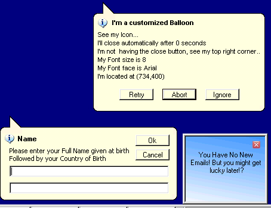



## Active\-X Popup MsgBox's \(Update 7/2/03\)

### Description

Displays Three Types Of Customizable Message Boxes. A Balloon Style MsgBox, A Balloon Style Input Box And A MSN Style Message Box. Open The Group Project And Run It From There.
 
### More Info
 

             |
---                |---
**Submitted On**   |2003-07-02 22:51:46
**By**             |[Dream](https://github.com/Planet-Source-Code/PSCIndex/blob/master/ByAuthor/dream.md)
**Level**          |Intermediate
**User Rating**    |4.9 (224 globes from 46 users)
**Compatibility**  |VB 6\.0
**Category**       |[Custom Controls/ Forms/  Menus](https://github.com/Planet-Source-Code/PSCIndex/blob/master/ByCategory/custom-controls-forms-menus__1-4.md)
**World**          |[Visual Basic](https://github.com/Planet-Source-Code/PSCIndex/blob/master/ByWorld/visual-basic.md)
**Archive File**   |[Active\-X\_P160880722003\.zip](https://github.com/Planet-Source-Code/dream-active-x-popup-msgbox-s-update-7-2-03__1-46003/archive/master.zip)

